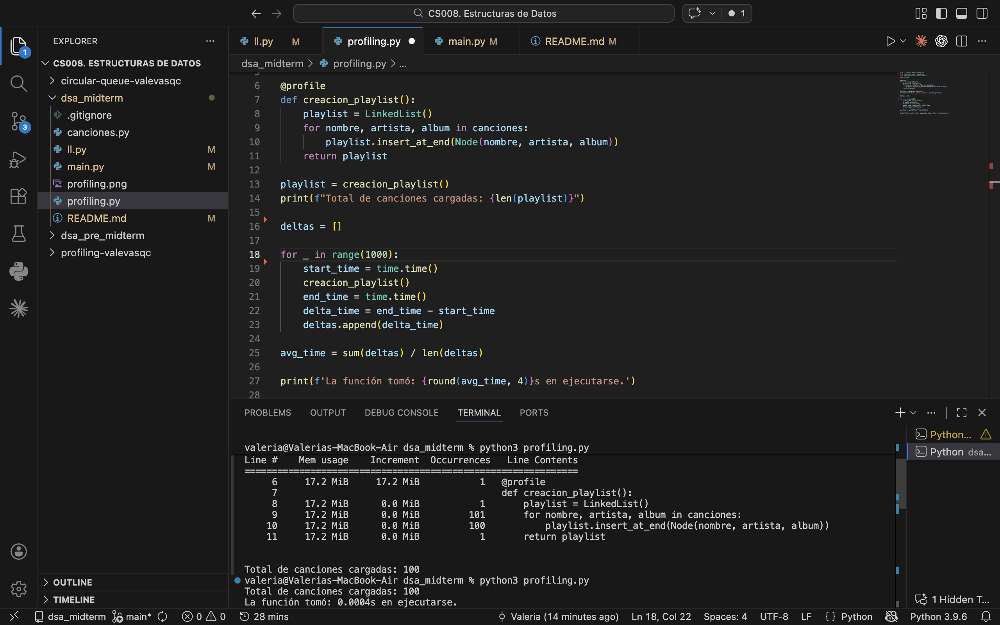

# dsa_midterm

## Clonar y ejecutar

```bash
git clone git@github.com:valevasqc/dsa_midterm.git
cd dsa_pre_midterm
python3 main.py
```

## Controles de la playlist

- `n`: siguiente canción
- `p`: canción anterior
- `q`: salir

La reproducción inicia en la primera canción.
La playlist no es circular: el inicio y el final son límites.

### Shuffle
- Lógica básica: caminar un número random desde el inicio. Si el random sale 5, hacer 5 nexts
- Complejidad temporal: O(n) porque tiene que moverse los espacios que haya salido en el random

## Profiling
Line #    Mem usage    Increment  Occurrences   Line Contents
=============================================================
     6     17.2 MiB     17.2 MiB           1   @profile
     7                                         def creacion_playlist():
     8     17.2 MiB      0.0 MiB           1       playlist = LinkedList()
     9     17.2 MiB      0.0 MiB         101       for nombre, artista, album in canciones:
    10     17.2 MiB      0.0 MiB         100           playlist.insert_at_end(Node(nombre, artista, album))
    11     17.2 MiB      0.0 MiB           1       return playlist

Total de canciones cargadas: 100
La función tomó: 0.0004s en ejecutarse.

- El espacio en memoria que ocupa es siempre casi el mismo, pues carga la lista de canciones y cualquier incremento posterior al incluirlos en la linkedlist es mínimo, por lo que el redondeo se queda en 0.
- El tiempo de ejecución también es bajo, indicando eficiencia.

